<h3><code>suhas@github ~ $ ./contributions.sh</code></h3>

  

<h3><code>suhas@github ~ $ whoami</code></h3>

<table>
<tr>
<td valign="top">

</td>

<td valign="top">

</td>
</tr>
</table>

  

<h3><code>suhas@github ~ $ ./links.sh</code></h3>

<b>CS+Math Student · Full Stack Developer · AI/ML Researcher</b>

)

